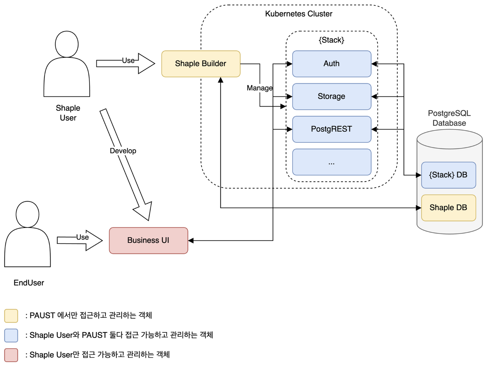

# Shaple Concepts

## Shaple 에서 쓰이는 용어

- *ShapleCustomer*
    - or `Shaple고객`, `섀플고객`, `고객`, `고객사`
    - *Shaple* 에 돈을 지불해서 *ShapleUser*가 사용할 수 있도록 하는 사람/기업
- *ShapleUser*
    - or `애플리케이션 UI 개발자`, `섀플유저`, `개발자들`
    - Shaple 을 사용하여 자신의 비즈니스를 영위하고자 하는 개발자/기획자/디자이너
- *EndUser*
    - *or*`사용자`, `엔드유저`
    - *ShapleUser* 에 의해서 만들어진 Application 을 사용하는 사람
- *ShapleBuilder*
    - *or `Shaple`*
    - *Project*
        - `Project`
        - Stack 의 집합체
        - 프로젝트 이름, 깃헙 리포, 기타 정보 등의 메타데이터를 관리
        - 다른 *ShapleUser* 를 초대하여 공유 가능
    - *Stack*
        - `Stack 1`, `Stack N`
        - 실질적인 *Service* 관리 단위
        - *ShapleBuilder* 내에서 *Stack* 단위로 격리되어 운영됨
        - 다른 *Stack* 으로 침입 또는 접근이 불가능
    - *Service*
        - `Auth`, `Database`, `Storage`
        - *Stack* 에서 제공하고 있는 백엔드 기능의 단위
        - 임의의 *Service* 로 API 추가가 무제한 가능함
- *Boilerplate*
    - or `예제`, `서비스 예제`, `유즈케이스`
    - Shaple을 사용해서 PAUST에서 만든 기본 코드 및 아키텍처
